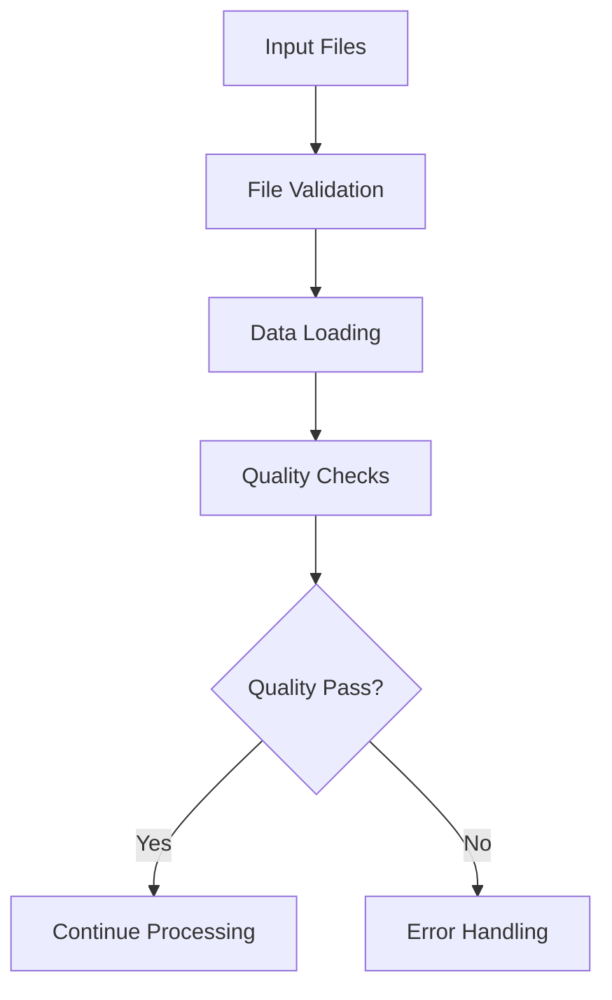

# SCRPA Time v3 - Technical Documentation

## Table of Contents
1. [System Architecture](#system-architecture)
2. [Code Structure](#code-structure)
3. [Data Processing Flow](#data-processing-flow)
4. [Configuration Management](#configuration-management)
5. [Error Handling](#error-handling)
6. [Performance Optimization](#performance-optimization)
7. [Maintenance Procedures](#maintenance-procedures)
8. [Development Guidelines](#development-guidelines)

## System Architecture

### Core Components
```
SCRPA_Time_v3_Production_Pipeline.py
├── SCRPAProductionPipeline (Main Class)
│   ├── Data Validation Module
│   ├── Hybrid Filtering Engine
│   ├── Quality Assurance System
│   ├── Export Generation Module
│   ├── Logging & Monitoring
│   └── Backup & Recovery
```

### Technology Stack
- **Language**: Python 3.7+
- **Core Libraries**: pandas, numpy, json, re, logging
- **Data Format**: CSV (input/output), JSON (metadata)
- **Storage**: Local file system with OneDrive sync
- **Monitoring**: File-based logging with rotation

### Directory Structure
```
SCRPA_Time_v2/
├── SCRPA_Time_v3_Production_Pipeline.py  # Main executable
├── README_SCRPA_Time_v3.md              # User documentation
├── 04_powerbi/                          # Input data directory
│   ├── C08W31_*_cad_data_standardized.csv
│   └── C08W31_*_rms_data_standardized.csv
├── 05_Exports/                          # Output directory
│   ├── SCRPA_CAD_Filtered_*.csv
│   ├── SCRPA_RMS_Matched_*.csv
│   └── SCRPA_Processing_Summary_*.json
├── backups/                             # Automatic backups
│   └── backup_YYYYMMDD_HHMMSS/
├── logs/                                # Processing logs
│   └── scrpa_production_YYYYMMDD.log
└── [documentation files]
```

## Code Structure

### Main Class: SCRPAProductionPipeline

#### Initialization
```python
class SCRPAProductionPipeline:
    def __init__(self, config: Optional[Dict] = None):
        self.config = config or self._default_config()
        self.logger = self._setup_logging()
        self.target_crimes = [...]  # Crime type definitions
        self.crime_patterns = {...} # Regex patterns for matching
```

#### Key Methods

##### 1. Data Validation
```python
def validate_input_files(self, cad_path: str, rms_path: str) -> bool
def validate_data_quality(self, cad_df: pd.DataFrame, rms_df: pd.DataFrame) -> Dict
def _validate_header_compliance(self, df: pd.DataFrame) -> Dict
```

##### 2. Data Processing
```python
def apply_hybrid_filtering(self, cad_df: pd.DataFrame, rms_df: pd.DataFrame) -> Tuple
def match_crime_pattern(self, text: str, crime_type: str) -> bool
def _calculate_validation_metrics(self, cad_cases: Dict, rms_df: pd.DataFrame) -> Dict
```

##### 3. Export and Monitoring
```python
def create_powerbi_exports(self, cad_filtered: pd.DataFrame, rms_matched: pd.DataFrame, export_stats: Dict) -> Dict
def generate_pipeline_dashboard(self, processing_stats: Dict, quality_report: Dict, export_info: Dict) -> Dict
def create_backup(self, source_files: List[str]) -> str
```

### Crime Pattern Engine

#### Pattern Definitions
```python
self.crime_patterns = {
    "Motor Vehicle Theft": [
        r"motor\s*vehicle\s*theft",
        r"theft\s*of\s*motor\s*vehicle", 
        r"auto\s*theft",
        r"240\s*=\s*theft\s*of\s*motor\s*vehicle"
    ],
    "Robbery": [
        r"robbery",
        r"120\s*=\s*robbery"
    ],
    # ... additional patterns
}
```

#### Pattern Matching Logic
```python
def match_crime_pattern(self, text: str, crime_type: str) -> bool:
    if pd.isna(text):
        return False
    
    text = str(text).lower().strip()
    patterns = self.crime_patterns.get(crime_type, [])
    
    for pattern in patterns:
        if re.search(pattern, text, re.IGNORECASE):
            return True
    return False
```

### Data Quality Framework

#### Validation Hierarchy
1. **File Level**: Existence, accessibility, format
2. **Structure Level**: Required columns, header compliance
3. **Content Level**: Data completeness, value validation
4. **Business Level**: Crime pattern matching, validation rates

#### Quality Thresholds
```python
min_validation_rate = 70.0     # Minimum acceptable validation rate
max_processing_time = 300      # Maximum processing time (seconds)
completeness_threshold = 80.0  # Minimum data completeness percentage
```

## Data Processing Flow

### 1. Input Processing


### 2. Hybrid Filtering Algorithm
```python
# Step 1: CAD Filtering
for crime in target_crimes:
    incident_matches = cad_df['incident'].apply(lambda x: match_crime_pattern(x, crime))
    response_matches = cad_df['response_type'].apply(lambda x: match_crime_pattern(x, crime))
    category_matches = cad_df['category_type'].apply(lambda x: match_crime_pattern(x, crime))
    
    combined_matches = incident_matches | response_matches | category_matches
    crime_cases = cad_df[combined_matches]['case_number'].tolist()

# Step 2: RMS Validation
for crime in target_crimes:
    nibrs_matches = rms_df['nibrs_classification'].apply(lambda x: match_crime_pattern(x, crime))
    rms_cases = rms_df[nibrs_matches]['case_number'].tolist()
    
    validated_cases = set(cad_cases).intersection(set(rms_cases))
    validation_rate = len(validated_cases) / len(cad_cases) * 100
```

### 3. Export Generation
```python
# Export with timestamp naming
timestamp = datetime.now().strftime("%Y%m%d_%H%M%S")
cad_export_path = output_dir / f"SCRPA_CAD_Filtered_{timestamp}.csv"
rms_export_path = output_dir / f"SCRPA_RMS_Matched_{timestamp}.csv"

# Generate processing summary
processing_summary = {
    'export_timestamp': datetime.now().isoformat(),
    'processing_stats': export_stats,
    'crime_distribution': crime_distribution,
    'powerbi_integration': {'ready': True}
}
```

## Configuration Management

### Default Configuration
```python
def _default_config(self) -> Dict:
    return {
        'input_dir': r"C:\...\04_powerbi",
        'output_dir': r"C:\...\05_Exports", 
        'backup_dir': r"C:\...\backups",
        'log_dir': r"C:\...\logs",
        'enable_backup': True,
        'enable_rollback': True,
        'quality_checks': True,
        'performance_monitoring': True
    }
```

### Environment-Specific Settings
```python
# Development
config_dev = {
    'min_validation_rate': 50.0,  # Lower threshold for testing
    'enable_backup': False,       # Disable backups in dev
    'log_level': 'DEBUG'         # Verbose logging
}

# Production  
config_prod = {
    'min_validation_rate': 70.0,  # Standard threshold
    'enable_backup': True,        # Enable backups
    'log_level': 'INFO'          # Standard logging
}
```

## Error Handling

### Exception Hierarchy
```python
# File System Errors
FileNotFoundError: Input files missing
PermissionError: Access denied to directories
IOError: File read/write failures

# Data Validation Errors  
ValueError: Invalid data format or content
KeyError: Missing required columns
TypeError: Incorrect data types

# Processing Errors
RuntimeError: Processing pipeline failures
TimeoutError: Processing time exceeded
```

### Recovery Mechanisms
```python
def run_production_pipeline(self):
    try:
        # Main processing logic
        results = self._process_data()
        return results
    
    except FileNotFoundError as e:
        self.logger.error(f"Input file error: {e}")
        return self._create_error_result("FILE_NOT_FOUND", str(e))
    
    except ValueError as e:
        self.logger.error(f"Data validation error: {e}")
        return self._create_error_result("VALIDATION_FAILED", str(e))
    
    except Exception as e:
        self.logger.error(f"Unexpected error: {e}")
        self.logger.error(traceback.format_exc())
        return self._create_error_result("SYSTEM_ERROR", str(e))
```

### Backup and Rollback
```python
def create_backup(self, source_files: List[str]) -> str:
    backup_dir = Path(self.config['backup_dir'])
    timestamp = datetime.now().strftime("%Y%m%d_%H%M%S")
    backup_subdir = backup_dir / f"backup_{timestamp}"
    
    for file_path in source_files:
        if Path(file_path).exists():
            shutil.copy2(file_path, backup_subdir)
    
    return str(backup_subdir)
```

## Performance Optimization

### Processing Optimizations
1. **Vectorized Operations**: Use pandas vectorized functions
2. **Pattern Compilation**: Pre-compile regex patterns
3. **Memory Management**: Process data in chunks for large datasets
4. **Caching**: Cache frequently accessed patterns

### Code Examples
```python
# Vectorized pattern matching
def vectorized_crime_matching(self, df: pd.DataFrame, crime_type: str) -> pd.Series:
    patterns = self.crime_patterns[crime_type]
    combined_pattern = '|'.join(patterns)
    return df['incident'].str.contains(combined_pattern, case=False, na=False)

# Memory-efficient processing
def process_large_dataset(self, df: pd.DataFrame, chunk_size: int = 1000):
    for chunk in pd.read_csv(file_path, chunksize=chunk_size):
        yield self.process_chunk(chunk)
```

### Performance Monitoring
```python
def monitor_performance(func):
    def wrapper(*args, **kwargs):
        start_time = time.time()
        result = func(*args, **kwargs)
        end_time = time.time()
        
        processing_time = end_time - start_time
        if processing_time > max_processing_time:
            logger.warning(f"Slow processing: {processing_time:.2f}s")
        
        return result
    return wrapper
```

## Maintenance Procedures

### Code Maintenance

#### 1. Pattern Updates
```python
# Adding new crime patterns
def update_crime_patterns(self, crime_type: str, new_patterns: List[str]):
    if crime_type in self.crime_patterns:
        self.crime_patterns[crime_type].extend(new_patterns)
    else:
        self.crime_patterns[crime_type] = new_patterns
    
    # Validate patterns
    self._validate_patterns(crime_type)
```

#### 2. Configuration Updates
```python
# Update quality thresholds
def update_thresholds(self, validation_rate: float = None, processing_time: int = None):
    if validation_rate:
        self.min_validation_rate = validation_rate
    if processing_time:
        self.max_processing_time = processing_time
    
    self.logger.info(f"Thresholds updated: validation={self.min_validation_rate}%, time={self.max_processing_time}s")
```

### Database Maintenance

#### Log File Management
```python
# Rotate log files
def rotate_logs(self, max_age_days: int = 90):
    log_dir = Path(self.config['log_dir'])
    cutoff_date = datetime.now() - timedelta(days=max_age_days)
    
    for log_file in log_dir.glob("*.log"):
        if log_file.stat().st_mtime < cutoff_date.timestamp():
            log_file.unlink()
            self.logger.info(f"Removed old log: {log_file}")
```

#### Backup Cleanup
```python
# Clean old backups
def cleanup_backups(self, max_age_days: int = 90):
    backup_dir = Path(self.config['backup_dir'])
    cutoff_date = datetime.now() - timedelta(days=max_age_days)
    
    for backup_folder in backup_dir.glob("backup_*"):
        if backup_folder.stat().st_mtime < cutoff_date.timestamp():
            shutil.rmtree(backup_folder)
            self.logger.info(f"Removed old backup: {backup_folder}")
```

## Development Guidelines

### Code Standards
1. **PEP 8 Compliance**: Follow Python style guidelines
2. **Type Hints**: Use type annotations for method signatures
3. **Documentation**: Comprehensive docstrings for all methods
4. **Error Handling**: Explicit exception handling with logging

### Testing Framework
```python
import unittest
from unittest.mock import patch, MagicMock

class TestSCRPAPipeline(unittest.TestCase):
    def setUp(self):
        self.pipeline = SCRPAProductionPipeline()
    
    def test_crime_pattern_matching(self):
        # Test pattern matching functionality
        result = self.pipeline.match_crime_pattern("Motor Vehicle Theft", "Motor Vehicle Theft")
        self.assertTrue(result)
    
    def test_data_validation(self):
        # Test data quality validation
        mock_df = MagicMock()
        result = self.pipeline.validate_data_quality(mock_df, mock_df)
        self.assertIn('overall_status', result)
```

### Version Control
```bash
# Git workflow for updates
git checkout -b feature/crime-pattern-update
git add -A
git commit -m "Update crime patterns for sexual offenses"
git push origin feature/crime-pattern-update
# Create pull request for review
```

### Deployment Process
1. **Development**: Test changes in isolated environment
2. **Staging**: Validate with production-like data
3. **Production**: Deploy with backup and rollback plan
4. **Monitoring**: Monitor performance and quality metrics

---

**Document Version**: 3.0  
**Last Updated**: August 2025  
**Code Version**: SCRPA_Time_v3_Production_Pipeline.py  
**Review Schedule**: Quarterly  
**Maintainer**: SCRPA Technical Team